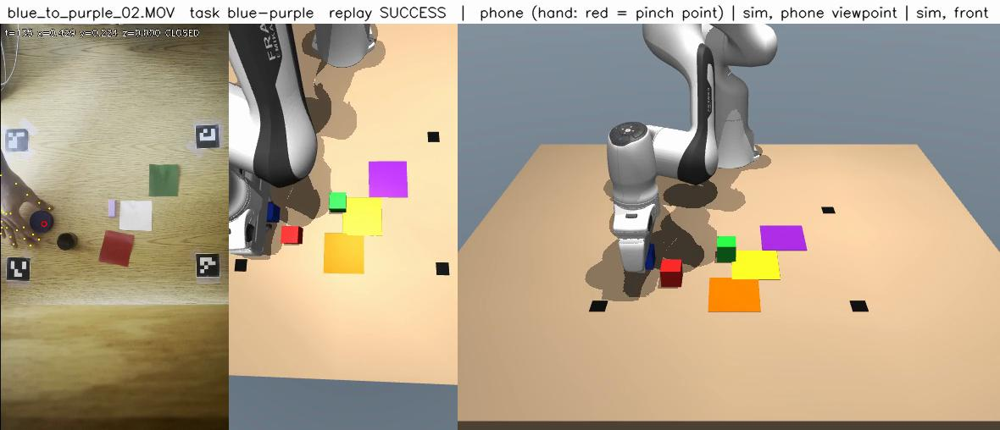
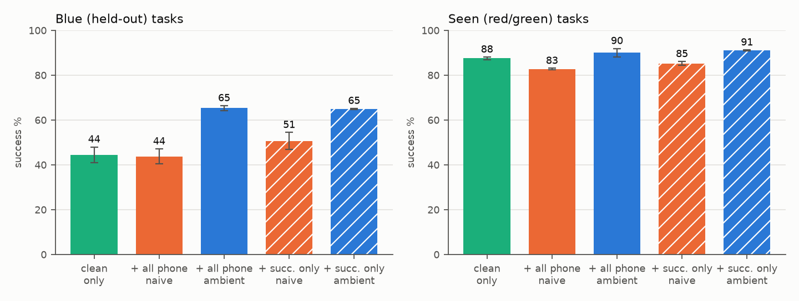
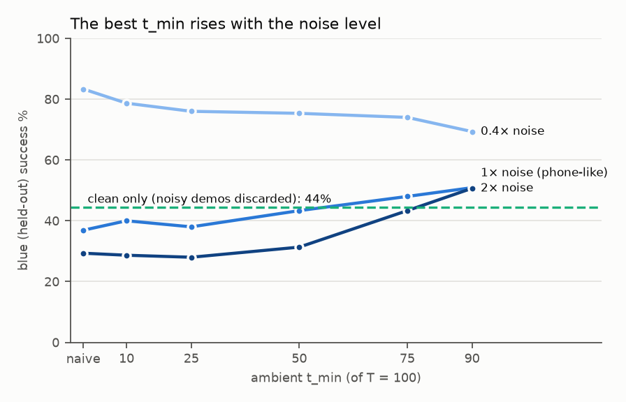
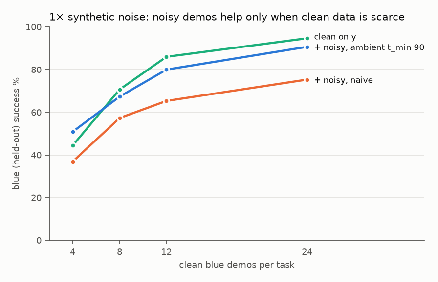

# Can noisy demonstrations help when clean data is scarce?

*Work in progress. Running log: `NOTES.md`. Plan: `PHASE2_PLAN.md`. Phone recording protocol: `RECORDING.md`.*

## Motivation

Robot post-training needs task demonstrations, and clean (teleoperated or scripted) demos are expensive. Human demonstrations recorded with a phone are cheap but noisy: the hand is tracked imperfectly, the human grasps differently from a parallel gripper, and the retargeted trajectories miss by centimeters. The question here is whether such noisy demos **improve** post-training when clean data for a new task is scarce, and whether an **ambient diffusion / flow-matching loss** (noisy samples only supervise the high-noise end of the diffusion process) makes them usable where naive training on them does not.

**Headline result (small diffusion policy, real phone demos, 4 clean demos per held-out task, 3 seeds).** With the ambient loss, the 48 phone replays raise held-out success from **44% to 65%**. The ambient loss also **beats filtering**: discarding the 11 replays that failed in sim and training naively on the rest reaches only 51%. And it gives **the same result with or without the failed replays** (65.3% vs 64.9%), so the noisy demos need no curation. Naive training on all replays gains nothing (44%).

| training data (blue = held-out cube) | seen % | blue % |
|---|---|---|
| clean only | 87.6 ± 0.6 | 44.4 ± 3.5 |
| + all 48 phone replays, naive | 82.8 ± 0.3 | 43.8 ± 3.3 |
| + 37 successful replays only (filtered), naive | 85.2 ± 0.9 | 50.7 ± 3.8 |
| + 37 successful replays only, ambient | 91.0 ± 0.3 | 64.9 ± 0.3 |
| **+ all 48 phone replays, ambient** | **90.0 ± 1.9** | **65.3 ± 1.1** |

The test bed is a simulated Franka Panda picking one of three colored cubes and placing it in one of three zones (9 tasks). The **blue cube is held out**: no sim demos ever target it (it is present as a distractor in every scene). Blue data comes only from a few clean sim demos and from phone recordings.

## Setup: phone → retargeting → sim

<!-- TODO: short paragraph per stage + numbers from NOTES.md (calibration, tracking, replay success) -->

1. **Recording** (`RECORDING.md`): a phone looks down at the table (43 cm, 0.5× lens); four ArUco markers give metric table coordinates in every frame; 48 clips (4 per red/green task, 8 per blue task).
2. **Extraction** (`scripts/process_phone.py`): MediaPipe hand tracking → pinch point and gripper open/close; objects from color or one click per clip; marker homographies per frame.
3. **Retargeting** (`human/retarget.py`): pinch point → gripper target at 10 Hz, contact-anchored height, dwell at gripper switches, and an **approach-from-above rule** (a human hand slides in low from the side; the parallel gripper must come down on the object). With the rule, sim replay success went from 44% to **77% (37/48)**.
4. **Replay in sim**: the retargeted trajectory is executed in MuJoCo and re-rendered; successful and failed replays are both kept as noisy demos.


*Phone recording with hand tracking (left), the sim replay from the phone's viewpoint (middle) and from the front (right). Videos for all 48 clips: `outputs/m2/3/*_side_by_side.mp4`.*

## Small diffusion policy (mechanism study)

A 5.4M-parameter DDPM policy (1D temporal U-Net, FiLM-conditioned on privileged state: gripper, cube and zone positions, plus a one-hot task) isolates the data/loss question from perception and language. Training data: 20 clean sim demos per red/green task, plus *K* clean demos per blue task, plus noisy demos. Ambient loss: noisy samples draw the diffusion step from [t_min, T). Evaluation: 50 episodes per task, fixed seeds.

### Real phone replays



With 4 clean blue demos per task, adding the 48 phone replays **naively** changes nothing on blue (44 → 44%) and costs seen performance; with the **ambient loss (t_min 75)** they raise blue success to **65%** (3 seeds each). Control (hatched bars): keeping only the 37 replays that succeeded in sim gives 51% with the naive loss and 65% with the ambient loss. So the ambient loss beats filtering out the failed replays, and it is insensitive to whether they are included. The gain is spread evenly across the three blue tasks (+17 to +25 points each).

### The best t_min rises with the noise level



Synthetic phone-like noise (per-episode grasp offset, height offset, jitter, gripper timing) at three levels. With mild noise the naive loss is best and the ambient loss only discards signal; with phone-level and stronger noise, the high-t_min end is best.

### Clean data vs noisy data



With 1× synthetic noise, the noisy demos (with the ambient loss) beat discarding them only at 4 clean demos per task; from 8 up, discarding is better, although the ambient loss recovers most of what naive training loses.

All numbers: [`docs/results_tables.md`](docs/results_tables.md) (generated by `python scripts/make_figures.py --results`).

## SmolVLA post-training

<!-- TODO: fill as the runs complete -->

- **Model and pipeline:** `lerobot/smolvla_base` (450M) post-trained from two 512 px cameras (scene + wrist), robot state and a language instruction; language layers unfrozen (SigLIP and connector frozen, so vision features are cached). Training runs on Colab A100s driven from the Mac (`colab/dcad.py`; run registry `colab/runs.json`; resumable jobs with all state on Drive; several VMs in parallel).
- **Diagnosis of the base policy** (sim only, 30k steps: 39% seen, 0% blue): 34% of seen episodes are missed grasps (vs 4% wrong cube), so seen performance is limited by grasp precision, not grounding; raw-image and cached-feature inference are bit-identical; the wrist camera shows the target clearly at the grasp; the flow-sampling spread (1.6 cm) is comparable to the grasp tolerance. The policy does not ground "blue" zero-shot (probe accuracy 0.03–0.12, below chance).
- **Base-policy fixes** (seen tasks, 120 episodes per cell, 95% CI about ±9 points):

  | checkpoint | sampling | success % | missed grasp % |
  |---|---|---|---|
  | V0 (30k steps) | normal | 39.2 | 34.2 |
  | V0 (30k steps) | zero noise | 43.3 | 33.3 |
  | + 3k steps of LR decay | normal | 40.8 | 34.2 |
  | + 3k steps of LR decay | zero noise | 45.8 | 29.2 |
  | + recovery demos + LR decay | normal | 54.2 | 22.5 |
  | + recovery demos + LR decay | zero noise | **65.0** | **16.7** |

  Recovery demos (DART-style: the scripted expert's path is perturbed by 1–3 cm and labeled with the nominal targets that lead back to it) are what moves closed-loop success; LR decay alone halves the training loss but changes nothing. Grasp diagnostics (`vla/grasp_diag.py`) explain why: at the gripper close, the policy's offset from the cube is **scatter, not bias** (mean 0.7–1.3 cm, no stable direction across checkpoints, vs a 2–2.7 cm spread), and the **offline** grasp-point error on training frames is small (0.26 cm median after decay) while the **closed-loop** error is large (rms 3.65 cm). The errors come from compounding drift in closed loop, which recovery data targets (rms 3.65 → 2.62 cm).
- **Scarce-clean-data runs** (C / C+N / C+N+amb) were on hold until the base policy's missed-grasp rate dropped (34% → 17% with recovery demos and zero-noise sampling); t_min for C+N+amb is 0.72 (= t_min 75 on the small policy, matched by noise-to-signal ratio).

## Limitations

- **Controlled phone setup.** The phone data comes from a fixed, marker-calibrated top-down camera, a flat uncluttered table, known object sizes and a recording protocol designed for the pipeline. Its noise therefore understates the gap to in-the-wild human video (moving cameras, no metric scale, occlusion, clutter).
- Phone demos are retargeted and re-rendered in sim, so the VLA never sees real phone pixels: this tests demonstration (action) noise, not the visual domain gap.
- **Single-seed VLA runs**, with 20 evaluation episodes per task (95% intervals of about ±10–15 points); the small policy has 3 seeds for the key cells only.
- One task family and one held-out object.

## Setup (local Mac)

Developed on an Apple Silicon MacBook (M4 Pro). Python 3.11 or 3.12.

```bash
conda create -n dcad python=3.11 -y && conda activate dcad     # or: python3.11 -m venv .venv && source .venv/bin/activate
pip install -r requirements.txt
```

Training picks `cuda`, then `mps`, then `cpu` (override with `--device`). MuJoCo uses its default offscreen renderer on macOS (`MUJOCO_GL=egl` on Linux).

## Run each stage

```bash
python -m pytest -q tests                                        # tests
python scripts/gen_sim_data.py --out data/sim_v2 --n_per_task 200 --tasks all
python policy/train.py --run_name A --data data/sim_v2 --sources sim --sim_tasks seen
python policy/evaluate.py --ckpt checkpoints/A/ckpt.pt --k 50 --out outputs/m3/A
python scripts/run_ambient_priority.py                           # small-policy ambient sweep (Mac)
python scripts/make_figures.py --results                         # README figures + tables
```

Phone data (see `RECORDING.md`):

```bash
python scripts/calib_colors.py data/raw_phone/<session> --check_all
python scripts/click_layout.py data/raw_phone/<session>
scripts/phone_to_colab.sh data/raw_phone/<session>               # process -> LeRobot dataset -> Drive
```

SmolVLA on Colab (A100), from the Mac:

```bash
python colab/dcad.py up                       # VM + code at the local HEAD; then `colab drivemount -s dcad`
python colab/dcad.py run <runs from colab/runs.json>
python colab/dcad.py wait --stop              # fetch results, flush Drive, stop the VM
```
